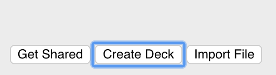
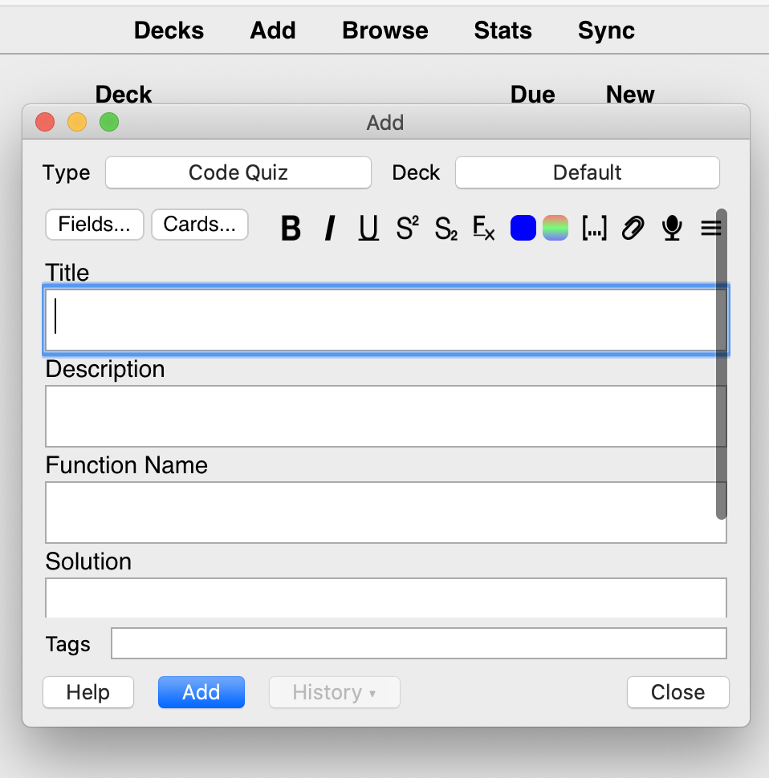

## How to create a code quiz?

1) Create the target deck (or select an existing one)

   

2) Click Add link at the top menu

   

3) Select "Code Quiz" as a card type

4) Check that the deck name is correct in the Deck select

5) In the `Title` field specify a short and unique title of the quiz

6) In the `Description` field provide the quizes full description, which can include example test-cases, algorithm performance requirements, etc
   For example:
   
   ```
      Given an array of integers nums, sort the array in ascending order.
      
      Example1:
      Input: nums = [4,3,2,1]
      Output: [1,2,3,4]
      
      Example2:
      Input: nums = [3,-1,0,6]
      Output: [-1,0,3,6]      
   ```

7) Specify a name of the target function `Function Name`. It will be used in the solution template.

8) `Solution` field will be displayed after Quiz submission, it contains Markdown-formatted solution description, it can also include code blocks as follows:
   \`\`\` java
   
   System.out.println("Hello World");
   \`\`\`
   
9) `Test-Cases` tab or semicolon separated values with test-cases. Read more about it's format here:
[Test cases format](test-cases-format.md)
