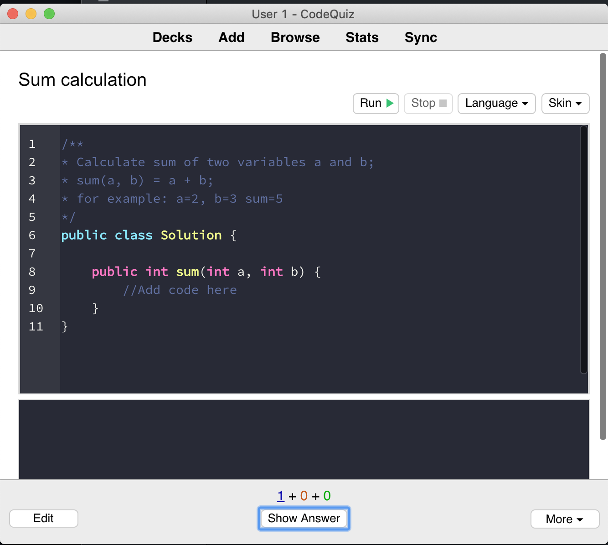
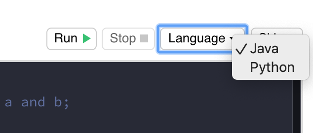
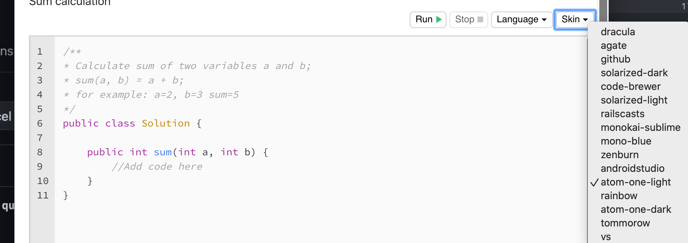
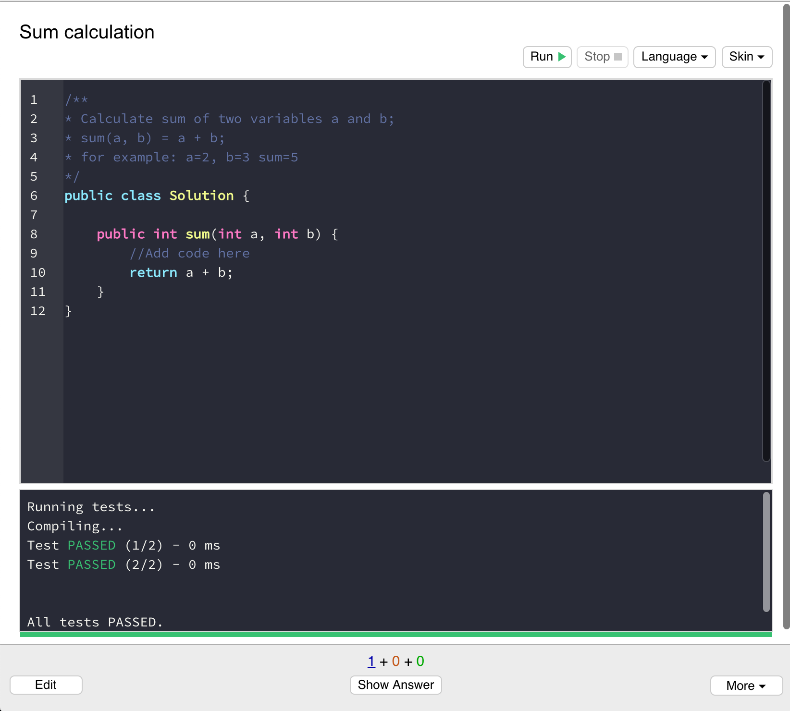
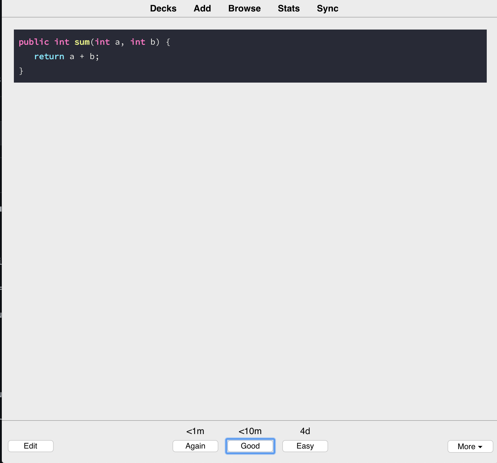
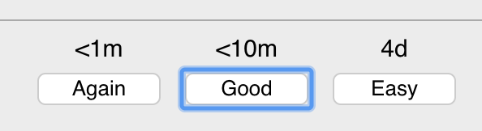

### How to execute existing a code quiz

1) Create or import the quiz.

2) Open the quiz by clicking on it's title.

   
   
3) You can select a programming language using the selectbox `Language` at the top right corner.

   

4) You can choose a different editor skin using the selectbox `Skin` at the top right corner.

      

5) You can test your solution, using `Run` button.   
   
    

6) If you want to stop the test - click `Stop` button.

7) Click `Show Answer` to see the correct solution.

       

8) After revieweing the solution you can click the corresponding button, depending on your results. Anki's integrated memorization algorithm will use it in order to calculate the next time slot to repeat the quiz.

       
