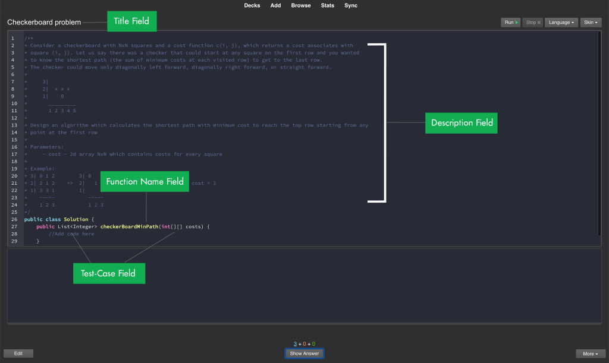

# Getting Started

## Anki
AnkiCode is a fork of Anki.
>[Anki Getting Started](https://docs.ankiweb.net/getting-started.html)

<br/>

## New card type - Programming Challenge
AnkiCode extends Anki by adding the new card type "Programming Challenge". Field list:

- Title
- Description
- Function name
- Solution ([Markdown](http://www.google.com) format)
- Test-Cases (read more about [format](http://www.google.com))

<br/>

Example:


| Field          | Value                                                      |
| -------------- | ---------------------------------------------------------- | 
| `Title`        | Sum of two integers.                                       |
| `Decsription`  | Given two integers calculate their sum.                    |
| `Function name`| sum                                                        |
| `Solution`     | \`\`\`js<br>function sum(a, b) { return a + b }<br>\`\`\`  |
| `Test-Cases`   | int;int;int<br>  1;  1;  2<br>  2;  2;  4<br>  3;  3;  6   |

<br/>

## Code Editor
Using the integrated code editor user can debug his solution, errors and log messages will be displayed in the Console.



>User can select a Programming Language and Theme using `Language` and `Skin` selectboxes.

<br/>

### Code Editor Hotkeys

| OS X   | Windows | Action |
| --------- | ---------- | -------------------- | 
| `Cmd + R` | `Ctrl + R` | Execute code         |
| `Cmd + J` | `Ctrl + J` | Switch to Java       |
| `Alt + J` | `Alt + J`  | Switch to JavaScript |
| `Alt + P` | `Alt + P`  | Switch to Python     |
| `Alt + C` | `Alt + C`  | Switch to C++        |

<br/>

## Test-Cases Format

Test-Cases are stored in CSV format (semicolon or tab-separated).

<br/>

### Test-Cases Header Format

Header contains all neccessary type meta-information for a function's arguments and return value.
Let's say we have to implement a function which takes N parameters and returns some type.

<br/>

The Header declaration will look like this:
`Arg1-Type`[`Arg1-Name`];`Arg2-Type`[`Arg2-Name`];...;`ArgN-Type`[`ArgN-Name`];`Result-Type`[`Verification-Opts`]

<br/>

- `ArgX-Type` Type for a specific argument (List of all supported types you can find below).
- `ArgX-Name` Argument's name - this parameter is optional.
- `Result-Type` Return value type (The function always must return some value, void type is not supported)
- `Verification-Opts` List of comma-separated options with the verification params (see below)

<br/>

### Supported Type Mappings

| Type            | Java   | Python |  C++      |  JavaScript  |
| --------------- | ------ | ------ | --------- | ------------ |
| `int`           | int    | int    | int       | Number       |
| `long`          | long   | int    | long int  | Number       |
| `float`         | double | float  | double    | Number       |
| `string`        | String | str    | string    | String       |
| `bool`          | bool   | bool   | bool      | Boolean      |
| `list`          | List   | List   | vector    | array        |
| `array`         | array  | List   | vector    | array        |
| `map`           | Map    | Dict   | map       | Map          |
| `object`        | class  | class  | struct    | Object       |

<br/>

### Supported Verification Types

| Name | Type    | Description |
| ---- | ------- | ----------- |
| ignore_order | boolean (True or False), False by default | ignore order of elements during results comparison |

<br/>

Example:

ignore_order=True => `[1, 0, 2]` == `[2, 0, 1]`
ignore_order=False => `[1, 0, 2]` != `[2, 0, 1]`

<br/>

### Primitive types declaration

`Arg-Type`[`Arg-Name`]
>note: `Arg-Name` is optional

<br/>

Example:
`int[i]`

Java
```java
foo_type foo(int i) {
   ...
}
```

Python
```python
def foo(i: int):
   ...
```

C++
```cpp
foo_type foo(int i) {
   ...
}
```

JavaScript
```js
function foo(i) {
   ...
}
```

<br/>

### Array/List type declaration
list|array(`Inner-Type`)[`Arg-Name`]
>note: `Arg-Name` is optional

<br/>

Example:
`array(int)[arr]`

Java
```java
foo_type foo(int[] arr) {
   ...
}
```
Python
```python
def foo(arr: List[int]):
   ...
```

C++
```cpp
foo_type foo(vector<int> arr) {
   ...
}
```

JavaScript
```js
function foo(arr) {
   ...
}
```

<br/>

### Object type declaration
object(`Field1-Type`[`Field1-Name`], `Field2-Type`[`Field2-Name`], ...)<`Object-Type`>
>note: `FieldX-Name` is optional

<br/>

Example:
`object(array(int)[arr], float[b], object(int[a], String[b])<SubType>[sub])<MainType>[main]`

Java
```java
public class SubType {
   public int a;
   public String b;
   public SubType(int a, String b) {
      this.a = a;
      this.b = b;
   }
}

public class MainType {
   public int[] arr;
   public SubType sub;
   public MainType(int[] arr, SubType sub) {
      this.arr = arr;
      this.sub = sub;
   }
}

void foo(MainType main) {
}
```

Python
```python
class SubType:
   def __init__(self, a: int, b: str):
      self.a = a
      self.b = b

class MainType:
   def __init__(self, arr: List[int], sub: SubType):
      self.arr = arr
      self.sub = sub
```

C++
```cpp
struct SubType {
   int a;
   string b;
};

struct MainType {
   vector<int> arr;
   SubType sub;
};
```

JavaScript

In JavaScript no explicit types will be generated, instead of it the corresponding [JS Doc](https://jsdoc.app/index.html) will be generated

