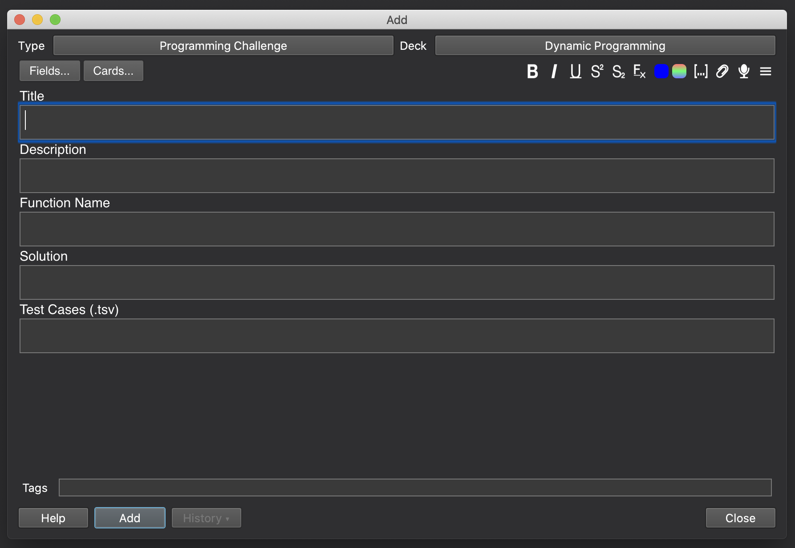
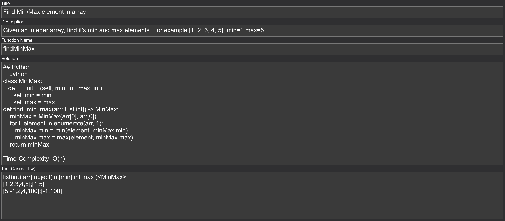
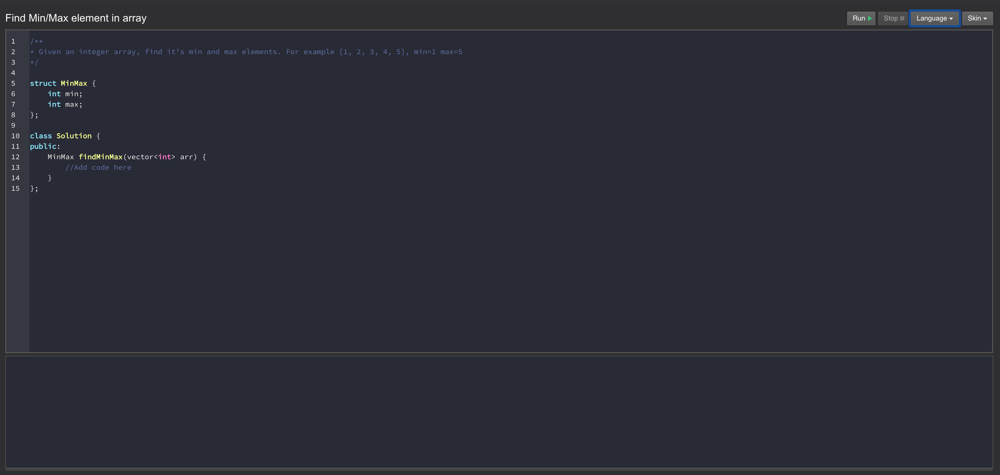
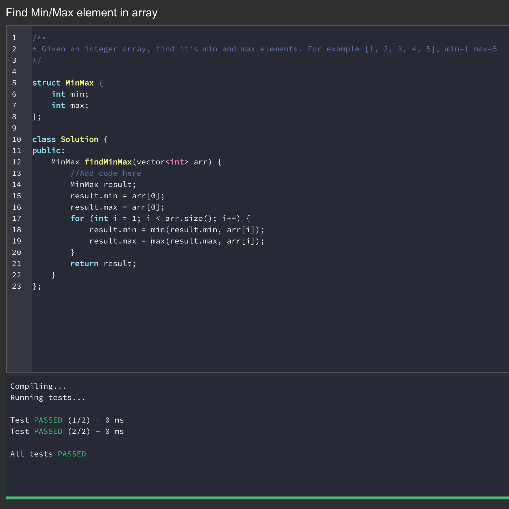

## How to create a Programming Challenge?

In this tutorial we will cover how to create custom programming challenges using AnkiCode UI.

### Task
Let's say you want to create a challenge which finds a min and max element in an integer array.

### Select a target deck or create one


### Click "Add" button in the top main menu



- Select target deck's name in the Deck select
- Select "Programming Challenge" in Type select

### Title

Populate a title for the challenge: "Find Min/Max element in array"

### Description

Description will be displayed in the code editor in the comments section, here you should describe the task:

"Given an integer array, find it's min and max elements. For example [1, 2, 3, 4, 5], min=1 max=5"

### Function Name

"findMinMax"

### Solution

Here we must specify the information in the Markdown format which contains the solution plus all information neccessary. It can be the following:

```python
class MinMax:
   def __init__(self, min: int, max: int):
      self.min = min
      self.max = max
def find_min_max(arr: List[int]) -> MinMax:
    minMax = MinMax(arr[0], arr[0])
    for i, element in enumerate(arr, 1):
       minMax.min = min(element, minMax.min)
       minMax.max = max(element, minMax.max)
    return minMax
```

Time-Complexity: O(n)

### Test-Cases

Test-Cases format is the following
```
array(int)[arr];object(int[min],int[max])<MinMax>
```

From this description it follows that the solution's function will accept 1 argument - integer array "arr" and must return a structure of type MinMax with 2 integer fields - min and max.

We will specify 2 rows to verify the results

```
[1,2,3,4,5];[1,5]
[5,-1,2,4,100];[-1,100]
```

### Card overview



- Click Save button

### Verify results

- Navigate to the parent deck by clicking on it's title (for easier testing it is better to create a separate Deck which will contain exactly 1 card)
- Click "Study Now"



### Select Language

- For every language selected - you will see that the template was changed.
- Now you can specify the solution code and click to Run it.
- If solution contains errors - they will be displayed in the Console window.



