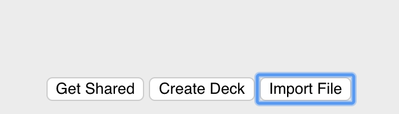
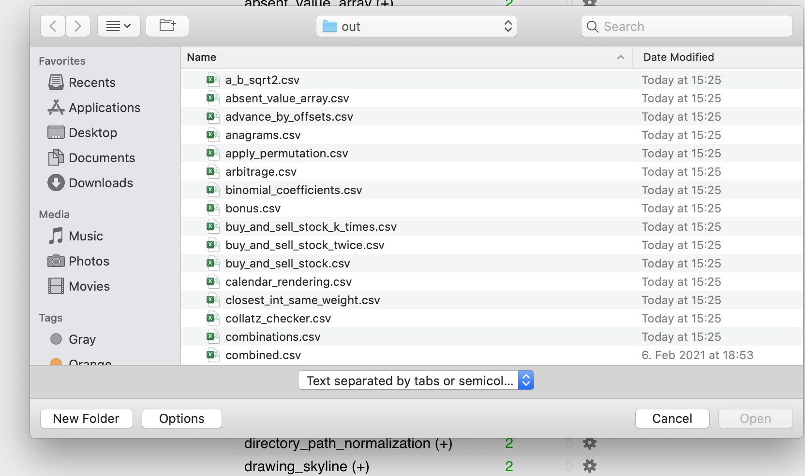
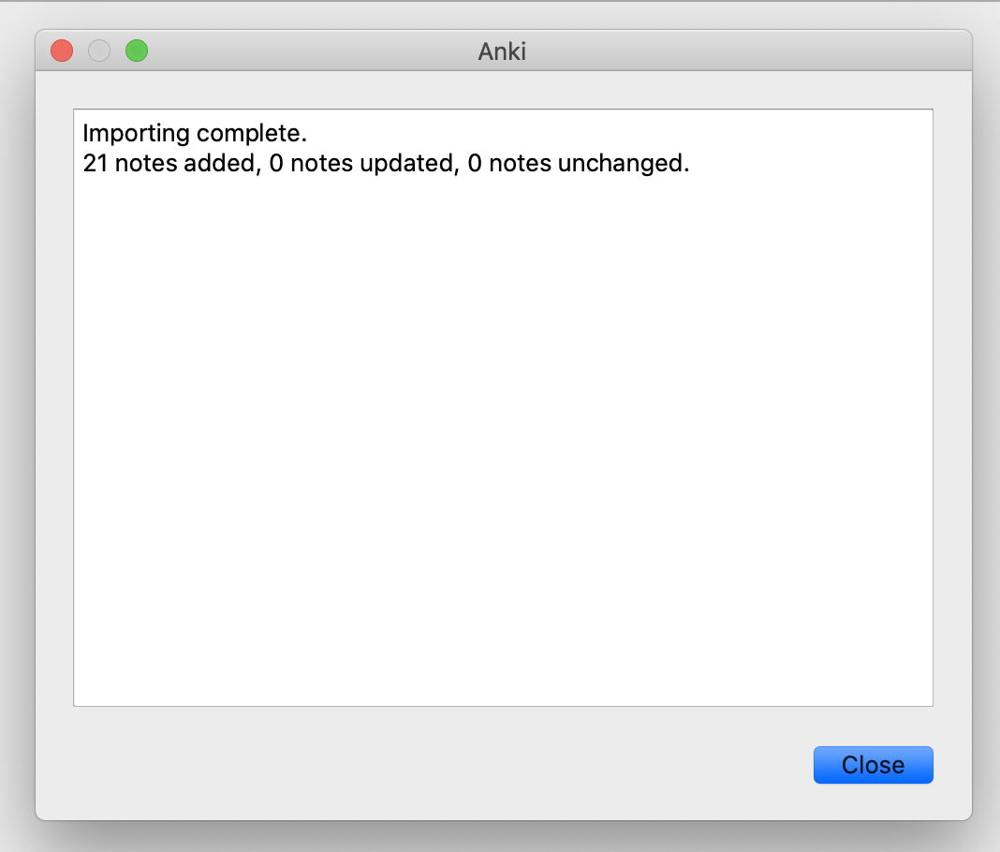

## How to import an existing code quiz?

1) Click "Import" button at the bottom buttons row.

   

2) Select a quiz file (.csv, .apkg)

   

3) Import it

   

You can find decks examples in the following repository:

   [CodeQuiz decks](https://github.com/daveight/codequiz-decks)
