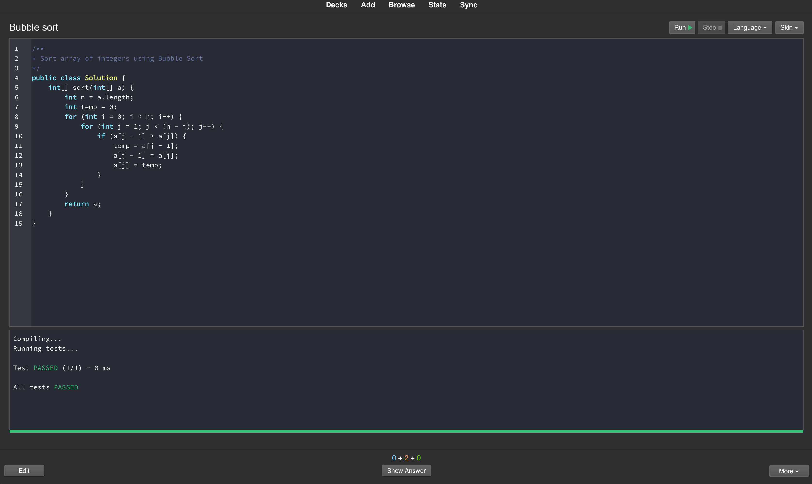

## About

CodeQuiz desktop app provides the fastest way to learn and memorize algorithms. 
The app uses spaced repetition of flashcards to increase the rate of learning.

CodeQuiz is a fork of [Anki](https://apps.ankiweb.net/) app.

### Supported Languages

- Java
- C++
- JavaScript
- Python

### Tutorials

- [Getting Started](getting-started.md)
- [Creating a CodeQuiz deck](create-quiz.md)
- [Test Cases format](test-cases-format.md)

### Algorithm Decks:

- [Sorting Algorithms](http://google.com)
- [Graph Algorithms](http://google.com)
- [Google Interview Questions](http://google.com)
- [Facebook Interview Questions](http://google.com)

### Downloads

